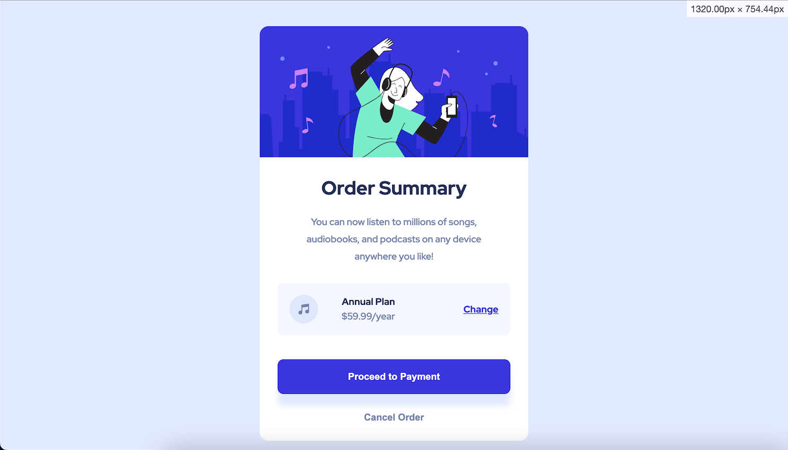

# Frontend Mentor - Order summary card solution

This is a solution to the [Order summary card challenge on Frontend Mentor](https://www.frontendmentor.io/challenges/order-summary-component-QlPmajDUj). Frontend Mentor challenges help you improve your coding skills by building realistic projects. 

## Table of contents

- [Overview](#overview)
  - [The challenge](#the-challenge)
  - [Screenshot](#screenshot)
  - [Links](#links)
- [My process](#my-process)
  - [Built with](#built-with)
  - [What I learned](#what-i-learned)
  - [Continued development](#continued-development)
  - [Useful resources](#useful-resources)
- [Author](#author)
- [Acknowledgments](#acknowledgments)

## Overview

### The challenge

Users should be able to:

- See hover states for interactive elements

### Screenshot

### Links

- Solution URL: [Add solution URL here](https://your-solution-url.com)
- Live Site URL: [Add live site URL here](https://your-live-site-url.com)

## My process
This time started with mobile first, designe the component to work with the stated design size, then made sure it would be responsive to a change in screen size using a media query.
The layout was straight forward, bit hero image and text to the top, set

### Built with

- Semantic HTML5 markup
- CSS custom properties
- Flexbox
- CSS Grid
- Mobile-first workflow

### What I learned

Struggled for a while trying to make the buttons sit away from the bottom of the "main" element. Adding a padding worked but the gap it created was way bigger than expected.
Resolvd it after reading an article about images, and realised the hero image needed to have `display: block;` set, otherwise it tries to flow round the bottom of the container, causing the extra spacing that was seen.

### Continued development

As ever, I clearly need to keep ironing out bumps and filling gaps in my CSS skills.

### Useful resources

- [Folkstalk](https://www.folkstalk.com/2022/10/image-inside-div-has-extra-space-below-the-image-with-code-examples.html) - Reading this was what helped resolve the spacing issue described above.

## Author

- Website - [Martin Coton](https://www.your-site.com)
- Frontend Mentor - [@MCoton](https://www.frontendmentor.io/profile/MCoton)
- Twitter - [@Martin_Coton](https://www.twitter.com/Martin_Coton)

## Acknowledgments

MDN and CSS Tricks, too hand for words.